# PadiBot System & Flow Diagrams
## Mermaid Diagrams untuk Architecture, User Journey, & State Management

---

## 📊 Diagram 1: User Journey - Complete Mission Flow

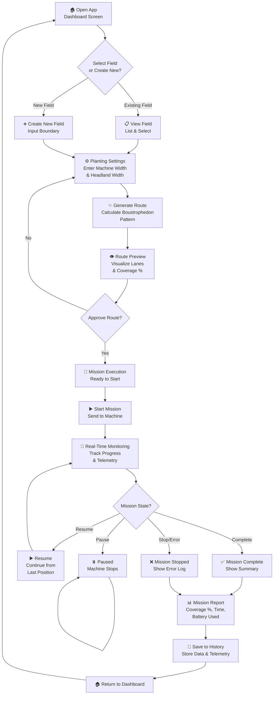

---

## 🏗️ Diagram 2: System Architecture

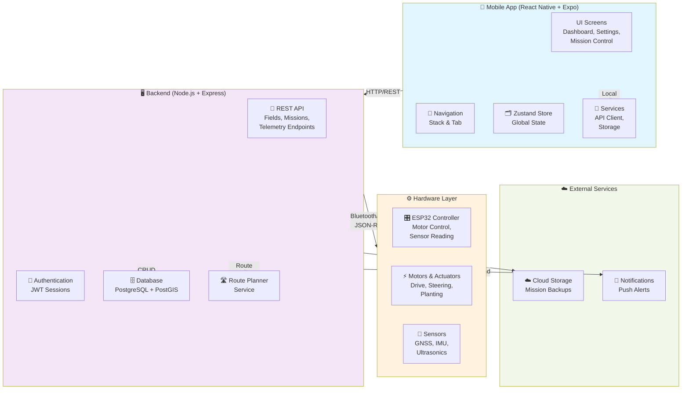

---

## 🔄 Diagram 3: Mission State Machine

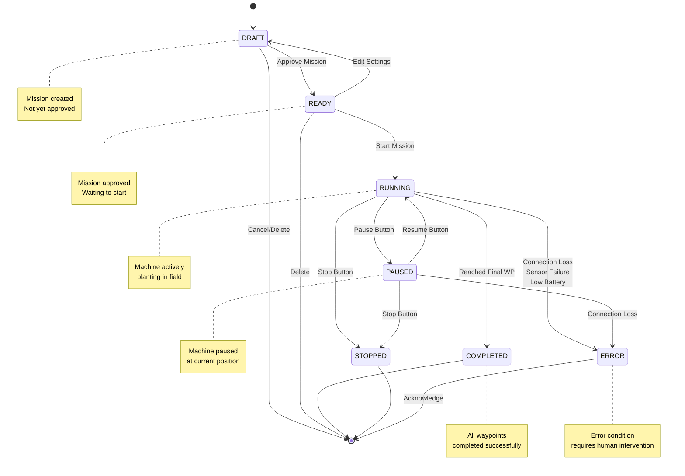

---

## 📡 Diagram 4: Real-Time Data Flow During Mission Execution

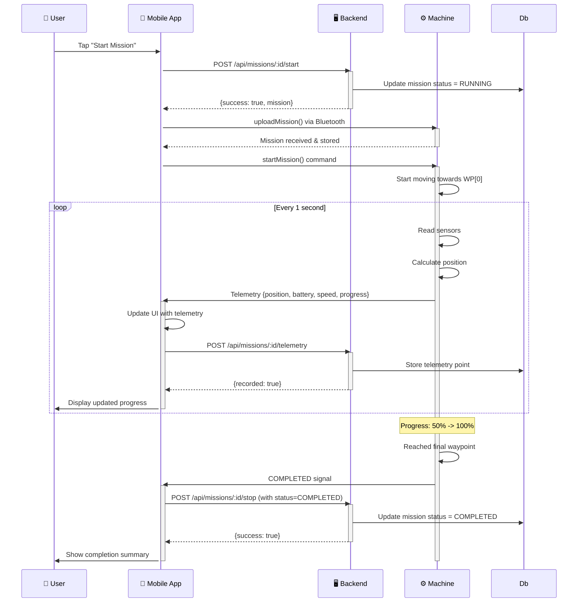

---

## 🗺️ Diagram 5: Route Generation Process

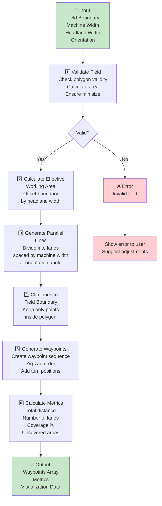

---

## 🔌 Diagram 6: Machine Connection Abstraction

```mermaid
graph TB
    App["📱 Mobile App"]
    
    Interface["MachineConnection<br/>Interface"]
    
    Simulator["SimulatorMachine<br/>Connection"]
    BT["BluetoothMachine<br/>Connection"]
    WiFi["WiFiMachine<br/>Connection"]
    GSM["GSMCloud<br/>Connection"]
    
    ESP["🎛️ ESP32<br/>Controller"]
    Motors["⚡ Motors"]
    Sensors["📍 Sensors"]
    Cloud["☁️ Cloud"]
    
    App -->|Uses| Interface
    
    Interface -.->|Implemented by| Simulator
    Interface -.->|Implemented by| BT
    Interface -.->|Implemented by| WiFi
    Interface -.->|Implemented by| GSM
    
    Simulator -->|Virtual| Motors
    Simulator -->|Simulated| Sensors
    
    BT -->|Short Range<br/>Low Latency| ESP
    WiFi -->|Local Network| ESP
    GSM -->|Remote| Cloud
    
    ESP -->|Control| Motors
    ESP -->|Read| Sensors
    Cloud -->|Store| Cloud
    
    note right of Interface
        Abstract interface
        isolates app from
        specific protocol
    end note
    
    note right of Simulator
        MVP: Development
        & testing without
        hardware
    end note
    
    style Interface fill:#bbdefb
    style Simulator fill:#c8e6c9
    style BT fill:#ffe0b2
    style WiFi fill:#ffe0b2
    style GSM fill:#ffe0b2
```

---

## 📊 Diagram 7: Telemetry Data Pipeline

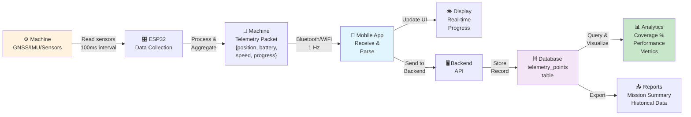

---

## 🎯 Diagram 8: Feature Dependency Graph

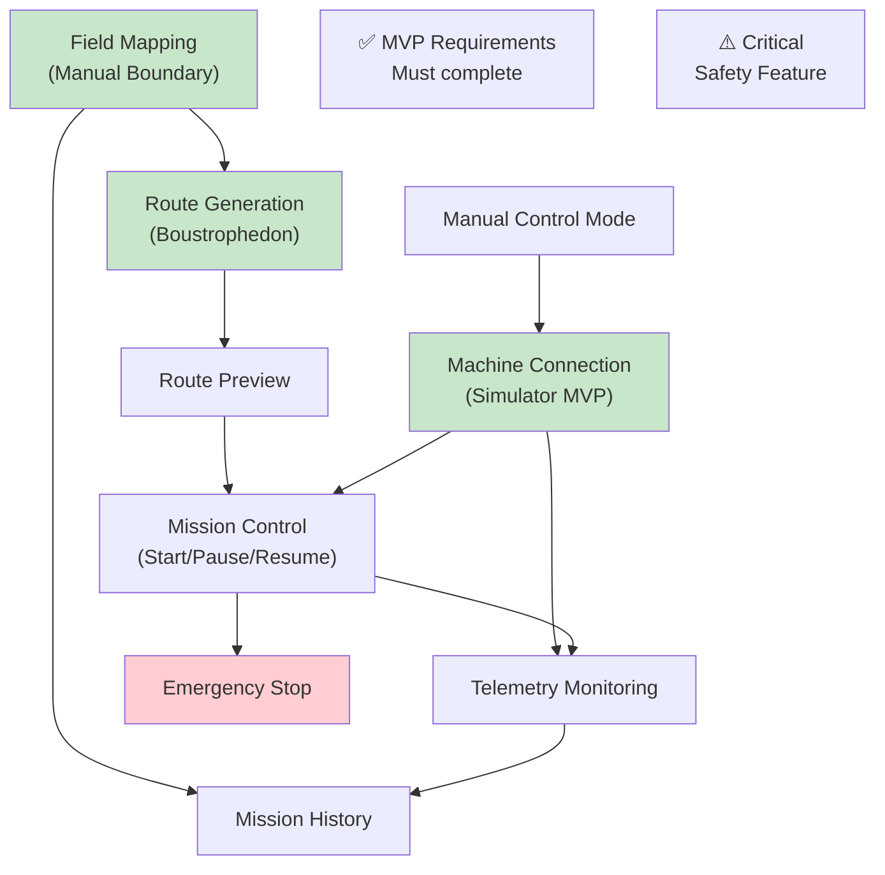

---

## 🚀 Diagram 9: Sprint Development Timeline

```mermaid
gantt
    title PadiBot MVP Development Timeline (6 weeks)
    
    section Sprint 1
    Project Setup :s1_1, 0d, 2d
    Route Planner :s1_2, after s1_1, 3d
    Machine Protocol :s1_3, after s1_2, 2d
    Backend Skeleton :s1_4, after s1_3, 2d
    
    section Sprint 2
    Navigation Setup :s2_1, 9d, 2d
    Dashboard Screen :s2_2, after s2_1, 2d
    Field Screens :s2_3, after s2_2, 2d
    Settings Form :s2_4, after s2_3, 2d
    History Screen :s2_5, after s2_4, 2d
    
    section Sprint 3
    Route Preview :s3_1, 19d, 2d
    Mission Execution :s3_2, after s3_1, 4d
    Simulator :s3_3, after s3_2, 4d
    Telemetry Logging :s3_4, after s3_3, 2d
    Backend Endpoints :s3_5, after s3_4, 3d
    
    section Sprint 4
    API Client Setup :s4_1, 32d, 1d
    Frontend-Backend Integration :s4_2, after s4_1, 3d
    Manual Control :s4_3, after s4_2, 2d
    Settings & i18n :s4_4, after s4_3, 1d
    UI Polish :s4_5, after s4_4, 2d
    
    section Sprint 5
    Route Tests :s5_1, 41d, 2d
    State Machine Tests :s5_2, after s5_1, 2d
    API Tests :s5_3, after s5_2, 2d
    E2E Testing :s5_4, after s5_3, 2d
    Documentation :s5_5, after s5_4, 2d
    Release :s5_6, after s5_5, 1d
```

---

## 🎨 Diagram 10: Screen Navigation Flow

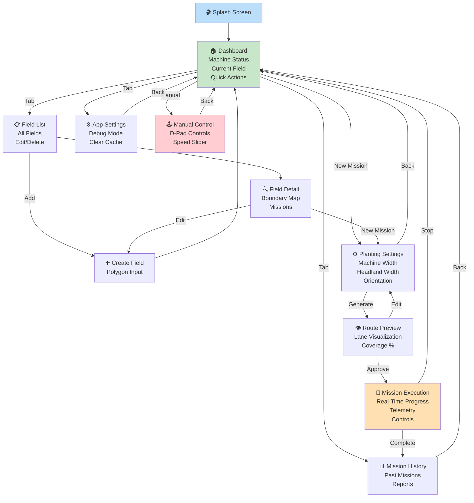

---

## 🔐 Diagram 11: Authentication & Authorization Flow

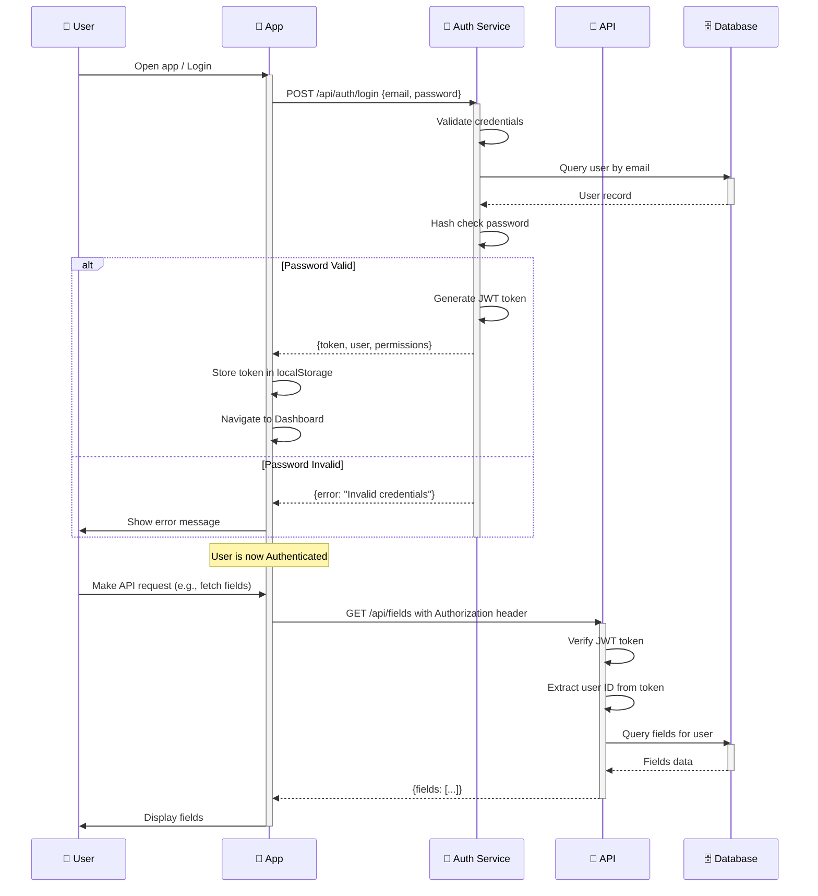

---

## 📝 Diagram 12: Error Handling & Recovery Flow

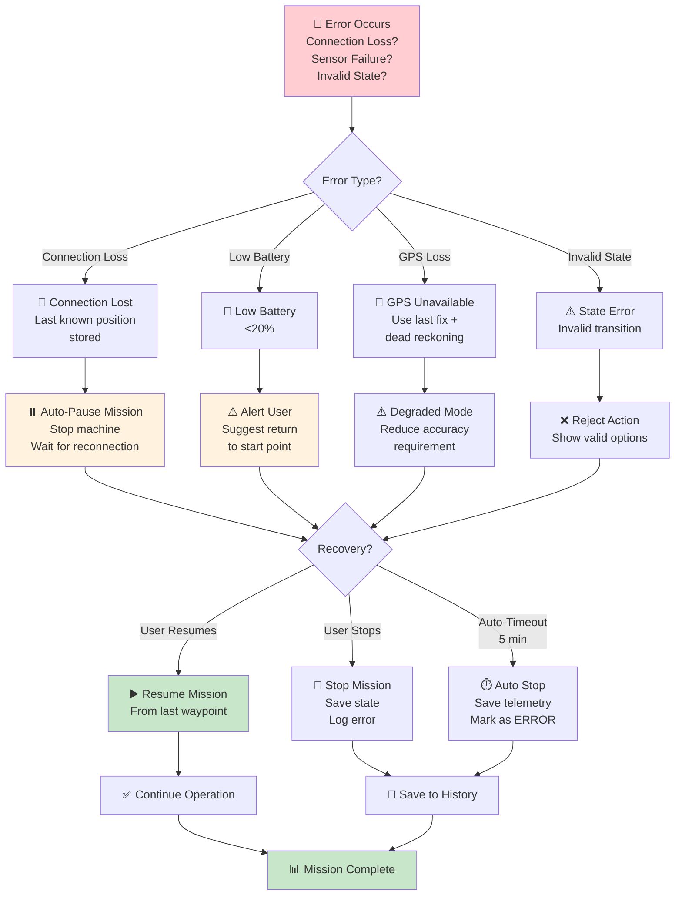

---

## 🧪 Diagram 13: MVP Testing Strategy

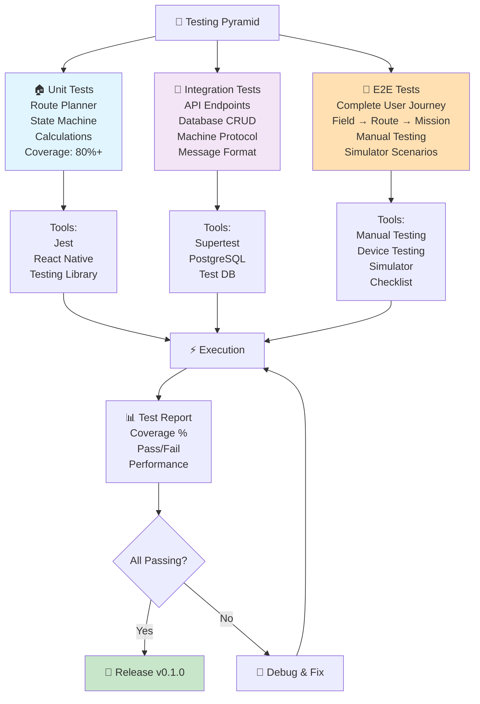

---

Generated for **PadiBot v1.1 PRD**  
Created: August 27, 2026  
Format: Mermaid Diagrams (mdx compatible)
