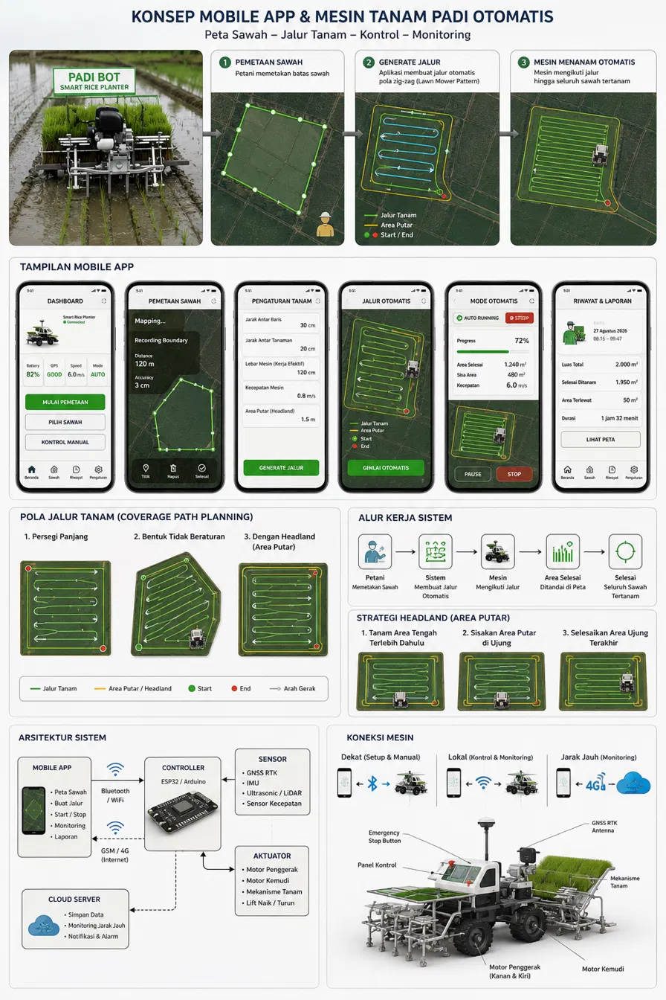
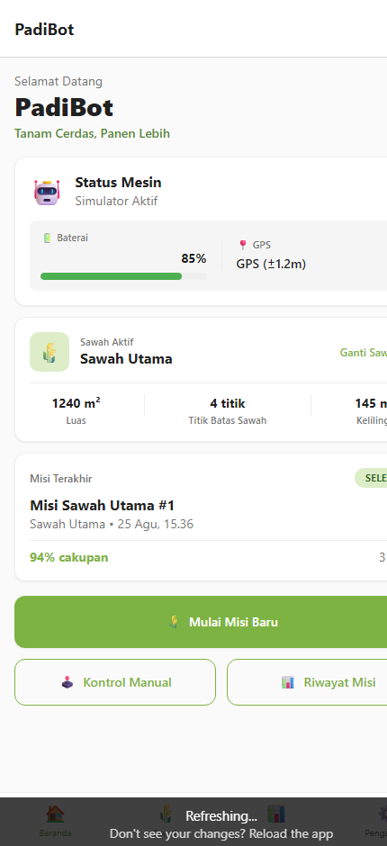
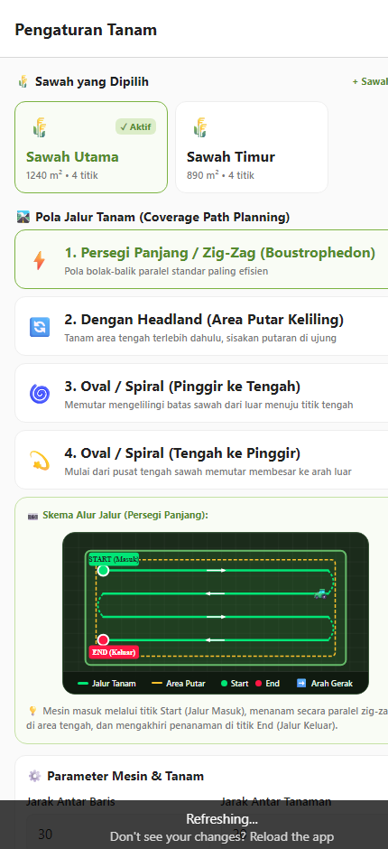
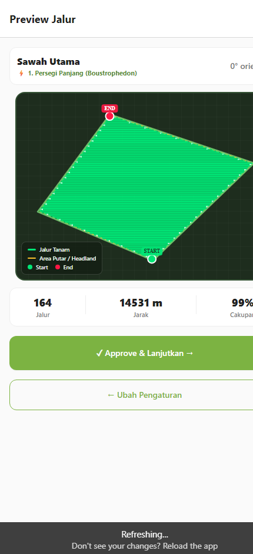
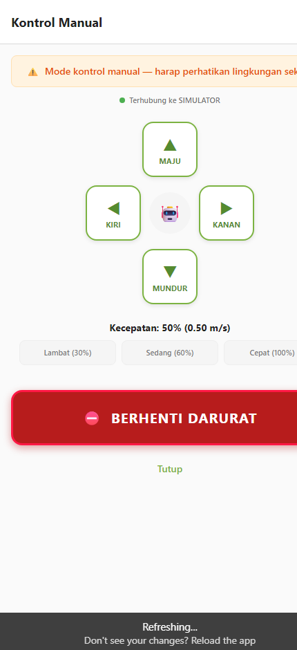

# 🌾 PadiBot — Smart Rice Planter

> **Sistem & Aplikasi Mobile Pengendali Mesin Tanam Padi Otomatis Berbasis Android, Web, & Arduino Controller**

[](https://github.com/adimaryanto-stack/Padi-Bot)
[](https://expo.dev)
[](https://expo.dev)
[](https://www.arduino.cc)
[](LICENSE)

---

## 📸 Konsep & Alur Kerja Sistem

<div align="center">
  
</div>

---

## 📱 Tampilan Antarmuka Aplikasi (Live Mobile Screenshots)

<div align="center">
  <table>
    <tr>
      <td align="center" width="25%">
        <b>1. Dashboard (Beranda)</b><br/>
        
      </td>
      <td align="center" width="25%">
        <b>2. Pengaturan Tanam</b><br/>
        
      </td>
      <td align="center" width="25%">
        <b>3. Preview Jalur Otomatis</b><br/>
        
      </td>
      <td align="center" width="25%">
        <b>4. Kontrol Manual D-Pad</b><br/>
        
      </td>
    </tr>
    <tr>
      <td align="center">
        <small>Monitoring status traktor, telemetri live, baterai, GPS RTK, dan pemilih petak sawah aktif.</small>
      </td>
      <td align="center">
        <small>Pilihan 4 pola rute (Boustrophedon, Headland, Spiral In/Out) + diagram alur visual dinamis.</small>
      </td>
      <td align="center">
        <small>Visualisasi peta vektor jalur tanam presisi tinggi dengan area putar headland kuning.</small>
      </td>
      <td align="center">
        <small>Tombol D-Pad manual interaktif untuk manuver traktor secara langsung + berhenti darurat.</small>
      </td>
    </tr>
  </table>
</div>

---

## 📋 Deskripsi

**PadiBot** adalah solusi presisi pertanian modern untuk membantu petani Indonesia mengotomatiskan proses penanaman bibit padi secara akurat, hemat waktu, dan efisien.

Aplikasi mobile dapat terhubung ke mikrokontroler mesin tanam (**ESP32 / Arduino**) melalui:
- 📶 **WiFi / WebSocket** — via ESP8266/ESP32 (latensi rendah, jangkauan ~100m)
- 🔵 **Bluetooth** — via HC-05/HM-10 BLE (koneksi instan tanpa router)
- 📡 **GSM 4G / MQTT** — via SIM800L/SIM7600 (monitoring jarak jauh unlimited)
- 🧪 **Simulator Virtual** — pengujian offline dan simulasi lintasan tanpa hardware fisik

Data petak sawah dan misi disimpan **lokal di SQLite / AsyncStorage** — **100% bekerja offline** di area persawahan tanpa jaringan internet.

---

## 🛣️ 4 Pola Jalur Tanam (*Coverage Path Planning*)

1. ⚡ **1. Persegi Panjang / Zig-Zag (Boustrophedon)**: Pola bolak-balik paralel standar paling efisien untuk petakan kotak.
2. 🔄 **2. Dengan Headland (Area Putar Keliling)**: Menanam area tengah terlebih dahulu, menyisakan area putar rapi di sekeliling batas sawah.
3. 🌀 **3. Oval / Spiral (Pinggir ke Tengah - Inward)**: Masuk dari sudut batas terluar, menanam memutar konsentris mengecil ke pusat tengah.
4. 💫 **4. Oval / Spiral (Tengah ke Pinggir - Outward)**: Mulai dari titik pusat tengah sawah, menanam memutar membesar ke arah batas luar.

---

## ✨ Fitur Utama

| Fitur | Deskripsi |
|-------|-----------|
| 🌾 **Pemilih Sawah Interaktif** | Pilih dan ganti petak sawah langsung dengan kalkulasi rute seketika |
| 🛣️ **4 Pola Rute Otomatis** | Algoritma *Coverage Path Planning* dengan kalkulasi metrik real-time |
| 📷 **Skema Visual Dinamis** | Diagram skema alur masuk (Start), jalur tanam, area putar, dan jalur keluar (End) |
| 👁️ **High-Def Map Preview** | Kanvas vektor peta sawah gelap dengan legenda lengkap & panah arah |
| 🎯 **Eksekusi Misi Live** | Pelacakan traktor live 🚜, progress bar, area selesai ($m^2$), sisa area, dan kecepatan |
| 🕹️ **Kontrol Manual** | Virtual D-Pad hold-to-move dengan slider kecepatan |
| ⛔ **Emergency Stop** | Tombol berhenti darurat dengan proteksi konfirmasi |
| 📊 **Riwayat & Laporan** | Pencatatan riwayat tanam, durasi, dan persentase cakupan |
| 💾 **Offline-First Storage** | SQLite + Drizzle ORM (Android) dan AsyncStorage (Web) |

---

## 🔧 Hardware & Komponen Mesin

### Controller & Komunikasi
- **ESP32 / Arduino Mega / Uno** (Unit Pemroses Utama)
- **Modul Komunikasi:** ESP32 WiFi / HC-05 Bluetooth / SIM7600 4G LTE
- **GNSS / RTK GPS:** u-blox NEO-M8N / ZED-F9P (Akurasi level sentimeter)
- **Motor & Aktuator:** Motor Penggerak Kanan-Kiri, Motor Kemudi, dan Mekanisme Tanam Padi

---

## 🚀 Cara Menjalankan Aplikasi

### 1. Di Browser / Komputer (Localhost)
```bash
# Clone repository
git clone https://github.com/adimaryanto-stack/Padi-Bot.git
cd Padi-Bot

# Install dependencies
npm install

# Jalankan server
npx expo start --web
```
Buka **`http://localhost:8081`** di browser.

### 2. Di Smartphone Android (Expo Go)
1. Buka aplikasi **Expo Go** di Android.
2. Masukkan URL: **`exp://<IP-KOMPUTER-ANDA>:8081`**

### 3. Build File Standalone `.apk`
```bash
# Build APK Android via EAS Cloud Build
eas build --platform android --profile preview
```

---

## 📁 Struktur Direktori

```
padi-bot/
├── app/                        # Halaman & Routing (Expo Router v3)
│   ├── (tabs)/                 # Tab Navigation (Beranda, Sawah, Riwayat, Pengaturan)
│   ├── mission/                # Alur Misi (Pengaturan Tanam, Preview Jalur, Eksekusi)
│   └── manual-control.tsx      # Modal Kontrol Manual D-Pad
├── components/                 # Komponen UI & Kanvas Peta
│   ├── mission/RouteCanvas.tsx # Kanvas Peta Rute Tanam High-Definition SVG
│   └── mission/PatternPreviewDiagram.tsx # Skema Diagram Pola Alur Visual
├── db/                         # Skema SQLite & Drizzle ORM
├── services/
│   ├── routePlanner/           # Algoritma Boustrophedon & Spiral Coverage Path
│   └── machineProtocol/        # Driver Koneksi WiFi, BT, GSM, & Simulator
├── stores/                     # Global State Management (Zustand)
├── docs/screenshots/           # Tangkapan Layar & Banner Aplikasi
└── aistudio-export.html        # Single-File Standalone Web App untuk Google AI Studio
```

---

## 👨‍💻 Author & Kontributor

**Adi Maryanto**  
GitHub: [@adimaryanto-stack](https://github.com/adimaryanto-stack)

---

## 📄 Lisensi

Proyek ini dilisensikan di bawah [MIT License](LICENSE).

> **PadiBot** — *Solusi Cerdas Tanam Padi Masa Depan* 🌾🤖
